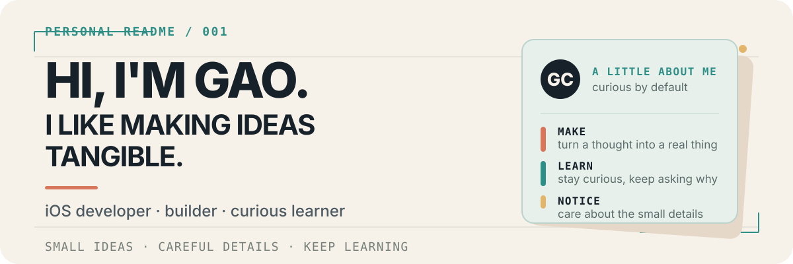

  

  <a href="https://github.com/Gao-Chenkai">GitHub</a>
  · <a href="https://gao-chenkai.github.io/">Portfolio</a>
  · <a href="https://x.com/KryptonGao">X</a>
  · <a href="mailto:DevChenkai@outlook.com">Email</a>

## About me

Hi, I’m **Gao Chenkai** — you may also know me as **Krypton**. I’m an iOS developer, a curious builder, and someone who enjoys taking a complicated idea and finding its smallest useful shape.

I like making things that feel clear and human: starting from a rough thought, learning whatever the problem requires, and gradually turning it into something real. I’m especially drawn to apps that help people learn, plan, reflect, or make better use of their time.

## What I’ve been up to

- Building apps for Apple platforms and experimenting with ideas that can grow beyond a single screen or device.
- Extending that work into desktop experiences and supporting services as the product needs them.
- Learning Rust and TypeScript by using them to solve real problems, not just by collecting another list of tools.
- Looking for thoughtful people to collaborate with on small products, learning tools, and AI-assisted workflows.

## A few things I care about

- **Make it understandable.** Good software should explain what it is doing.
- **Keep it useful.** A small working foundation is better than a grand unfinished idea.
- **Leave room for people.** Automation should be visible, reviewable, and easy to change.
- **Keep learning.** I enjoy following a question far enough to build something with the answer.

## Selected work

These are a few of the things I’ve been building and learning through:

- [**StudyPulse**](https://github.com/Gao-Chenkai/StudyPulse) — a learning companion for iPhone and iPad, bringing study records, review, focus, and reflection into one place.
- [**Voyara**](https://github.com/Gao-Chenkai/Voyara) — a travel-planning app built around local trips, maps, daily activities, and user-confirmed suggestions.
- [**StudyPulse-Desktop**](https://github.com/Gao-Chenkai/StudyPulse-Desktop) — a desktop workspace that carries the StudyPulse idea onto macOS and Windows.
- [**StudyPulseCloudAI**](https://github.com/Gao-Chenkai/StudyPulseCloudAI) — an optional service layer for AI-powered StudyPulse features.

## Connect with me

  
  
  

## Languages and Tools

  
  
  
  
  
  
  
  
  
  

  

## Let’s connect

If you enjoy thoughtful apps, learning in public, or turning a blank page into a working prototype, I’d be happy to hear from you.

[GitHub](https://github.com/Gao-Chenkai) · [Portfolio](https://gao-chenkai.github.io/) · [X / @KryptonGao](https://x.com/KryptonGao) · [Instagram / @kryptongao5525](https://instagram.com/kryptongao5525) · [DevChenkai@outlook.com](mailto:DevChenkai@outlook.com)
